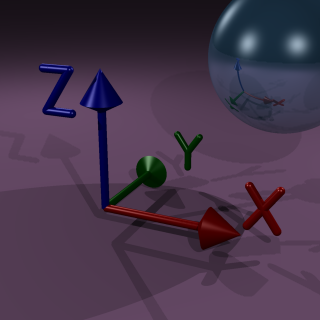

<link rel="stylesheet" href="./assets/help.css"/>

# Axis

The Bob coordinate system has an unusual arrangment of axes. Typically, in graphics
engines, the z axis is used for depth. In Bob, the z axis is used for height and the
y axis is used for depth.

The figure above shows the coordinates system for Bob.

---
