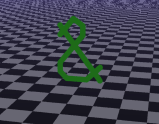
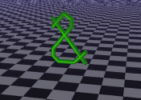
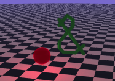
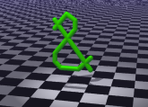

<link rel="stylesheet" href="../assets/help.css"/>

# Light Structure


# Usage

```
  light {
    type            directional   // Directional light
    type            point         // Point light
    type            spherical     // Spherical light
    type            spot          // Spot light
    at              x y z         // Point to shine at
    center          x y z         // Location in world space
    from            x y z         // Same as center
    color           r g b         // Color of light
    direction       x y z         // Direction light is pointing
    falloff         f             // Falloff rate
    radius          degrees       // Radius (spot or spherical)
    max_angle       degrees       // Maximum angle (spot)
    min_angle       degrees       // Minimum angle (spot)
    samples         i             // Number of samples to shoot
    no_shadows                    // Disable shadows
    no_spec                       // Disable specular shine
  }
```

# Light Kinds

There are four kind of lights:

* Directional
* Point
* Spherical
* Spot

# Directional Light

```
  light {
    type            directional   // Directional light
    color           r g b         // Color of light
    direction       x y z         // Direction light is pointing
  }
```


The image above shows a directional light.

# Point Light

```
  light {
    type            point         // Point light
    center          x y z         // Location in world space
    color           r g b         // Color of light
    falloff         f             // Falloff rate
  }
```



The image above shows a point light.

# Spherical Light

```
  light {
    type            spherical     // Spherical light
    center          x y z         // Location in world space
    color           r g b         // Color of light
    falloff         f             // Falloff rate
    radius          degrees       // Radius (spot or spherical)
    samples         i             // Number of samples to shoot
  }
```



The image above shows a spherical light.

# Spot Light

```
  light {
    type            spot          // Spot light
    center          x y z         // Location in world space
    color           r g b         // Color of light
    direction       x y z         // Direction light is pointing
    falloff         f             // Falloff rate
    max_angle       degrees       // Maximum angle (spot)
    min_angle       degrees       // Minimum angle (spot)
  }
```



The image above shows a spot light.

# Variable Applicability

| Name\Type | Directional | Point | Spherical | Spot |
| - | - | - | - | - |
| at         | X |   |   |   |
| center     | X | X | X | X |
| color      | X | X | X | X |
| direction  | X |   |   | X |
| falloff    |   | X | X | X |
| radius     |   |   | X |   |
| max_angle  |   |   |   | X |
| min_angle  |   |   |   | X |
| samples    |   |   | X |   |
| no_shadows | X | X | X | X |
| no_spec    | X | X | X | X |

# Falloff

Falloff determines how rapidly the light attenuates over distance.
The default is 0.

# Samples

Spherical lights require multiple samples (rays) to be shot from
various points on the surface of the light. The default is 16.

More samples slows down rendering considerably.

# Min and Max Angles

Spot lights have an umbra and a penumbra. The minimum angle
determines the size of the umbra (inner full lit area). The
maximum angle determines the size of the penumbra. This is
the slowly fading area from the umbra to the outer edge of
the illumination area.

The absolute minimum for either angle is 0.005 (macro MIN_LIGHT).

Typical values:

```
min_angle 5
max_angle 35
```

You can play around with spotlight angles here:

* See: [Umbra](umbra.html)

# Shadows Off

You can speed up rendering at the expense of realism by individually turning of
shadow feelers for any light.

```
light {
    ...
    no_shadows
}
```

# No Specular Effects

You can speed up rendering at the expense of realism by individually turning of
specular effects for any light.

```
light {
    ...
    no_spec
}
```

# At versus Direction

The **spot** and **directional** lights have a `direction` variable.

If you prefer, you can replace the `direction` keyword with an `at` keyword
instead. For clarity, you can use any of the synonyms for `center` that make
the most sense -- usually `from`.

The `at` keyword is a point. Bob uses this to calculate the `direction`
vector relative to `center`.

The `direction` keyword is a normal vector.

# Synonyms

The following synonyms are applicable.

| Keyword | Synonym |
| - | - |
| center | translate |
| position | translate |
| offset | translate |
| from  | translate |

---
