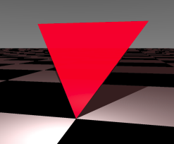

<link rel="stylesheet" href="../assets/help.css"/>

[prims]: <../prim.html>

# Patch Structure

The patch (or triangle) structure is one of the five primitive objects.

It's the simplest and possibly the most useful for building complex scenes.

# Usage

```
  patch {
    normal          x y z         // Vertex surface normal vector (x3)
    vertex          x y z         // Vertex location (x3)
    clip            {}            // One or more clip blocks
  }
```

# Example

Here's a simple example:

```
patch {
    vertex  0 0  0    normal 0 -1 0
    vertex  7 7 10    normal 0 -1 0
    vertex -7 7 10    normal 0 -1 0
}
```



The above image shows a patch on a checkered
floor.

# Primitives

There are five primitive objects altogether. These are discussed as a whole.

* See: [Primitive Objects][prims]

# Synonyms

The following synonyms are applicable.

| Keyword | Synonym |
| - | - |
| tri | patch |

---
