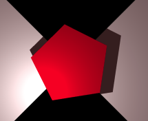

<link rel="stylesheet" href="../assets/help.css"/>

[prims]: <../prim.html>

# Poly Structure

The polygon structure is one of the five primitive objects. It represents a N-sided
polygon shape.

# Usage

```
  polygon {
    points          i             // Number of vertices
    vertex          x y z         // Vertex location
    clip            {}            // One or more clip blocks
  }
```

# Example

You must include one `vertex` entry for each vertex in the polygon. The total number of
vertices must equal the integer provided as an argument to the `point` keyword.

```
polygon {
points 5
vertex 5.000000 0.000000 0
vertex 1.545085 4.755282 0
vertex -4.045085 2.938926 0
vertex -4.045084 -2.938927 0
vertex 1.545086 -4.755282 0
}
```



The above image shows a 5-sided polygon (pentagon) on a checker floor.

# Primitives

There are five primitive objects altogether. These are discussed as a whole.

* See: [Primitive Objects][prims]

# Synonyms

The following synonyms are applicable.

| Keyword | Synonym |
| - | - |
| poly | polygon |

---
