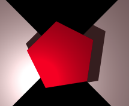
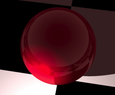

<link rel="stylesheet" href="./assets/help.css"/>

[cone]: <./cone/cone.html>
[patch]: <./patch/patch.html>
[poly]: <./poly/poly.html>
[ring]: <./ring/ring.html>
[sphere]: <./sphere/sphere.html>
[clip]: <./clip/clip.html>
[comp]: <comp.html>

# Primitives

There are five primitive objects offered by the app. All models must be constructed of one or more of these.

The names are:

* Cone
* Patch
* Polygon
* Ring
* Sphere

## Cone Primitive

The above image shows a dunce-cap shaped cone.

More shapes are available.

* See: [cone][cone]

## Patch Primitive

The above image shows a single patch (a.k.a. tri).

* See: [patch][patch]

## Polygon Primitive

The above image shows five sided polygon (pentagram).

* See: [poly][poly]

## Ring Primitive

The above image shows a disc shaped ring.

* See: [ring][ring]

## Sphere Primitive

The above image shows a sphere.

* See: [sphere][sphere]

# Degenerate Cases

You should always avoid degenerate cases in primitives. Basically, this is any case which would cause the volume (or area for some) to be zero.

# Clipping

Primitives can be clipped using CSG techniques.

* See: [clip][clip]

# Composites

The BSP system allows primitives to be bunches into
composite objects.

* See: [composite][comp]

# Index

| Name | Description | Notes |
| - | - | - |
| [cone][cone] | Dunce-cap, funnel or pipe | 1 |
| [patch][patch] | Triangle polygon | 2 |
| [poly][poly] | N-sided polygon | 2 |
| [ring][ring] | Platter or a hoop | 2 |
| [sphere][sphere] | Sphere | 1 |

## Notes

1. Has a volume
2. Has an area

---