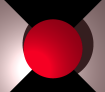
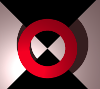

<link rel="stylesheet" href="../assets/help.css"/>

[prims]: <../prim.html>

# Ring Structure

The `ring` structure is one of the five primitive objects.

# Usage

```
  ring {
    center          x y z         // Location of the ring's center point
    normal          x y z         // Ring surface normal vector
    max_radius      f             // Outer radius
    min_radius      f             // Inner radius
    radius          f             // Outer radius
    clip            {}            // One or more clip blocks
  }
```

# Ring Kinds

There are two kinds of rings:

* Platter (or circle)
* Hoop (or disc) 

The distinction is determined by which radii are specified and there values.

# Circle/Platter Rings

A **circle** ring has no (or zero) minimum radius. For brevity, you can just use
the `radius` keyword and omit the keywords for the other radii.

```
ring {
    center 0 0 1
    normal 0 0 1
    radius 5
}
```



The above image shows a circle ring on a checker floor.

# Disc/Hoop Rings

A **disc** ring has two radii, both of which must be non zero. The maximum is the
outer radius and the minimum is the inner radius. This leaves a circular hole
in the middle so that the shape resembles a CD or DVD.

```
ring {
    center 0 0 1
    normal 0 0 1
    min_radius 3
    max_radius 5
}
```



The above image shows a disc ring on a checker floor.

# Primitives

There are five primitive objects altogether. These are discussed as a whole.

* See: [Primitive Objects][prims]

# Synonyms

The following synonyms are applicable.

| Keyword | Synonym |
| - | - |
| center | translate |
| position | translate |
| offset | translate |
| from  | translate |

---
