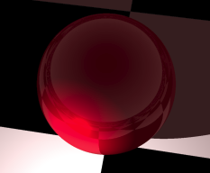
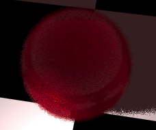

<link rel="stylesheet" href="../assets/help.css"/>

[prims]: <../prim.html>

# Sphere Structure

The `sphere` structure is one of the five primitive objects.

# Usage

```
  sphere {
    center          x y z         // Location of the sphere's center point
    fuzz            f             // Fuzziness coefficient
    radius          f             // Sphere radius
    clip            {}            // One or more clip blocks
  }
```

# Example

```
sphere {
    center 0 0 10
    radius 5
}
```



The above image shows a sphere on a checker floor.

# Fuzziness

Fuzziness introduces some randomness into the sphere's radius.
Fuzziness is useful for giving the sphere a "fuzzy-looking" surface.

The implied radius range during ray tracing is:

```
[radius ... radius+fuzz]
```

## Example of Fuzz

```
sphere {
    center 0 0 10
    radius 5
    fuzz 0.2
}
```



The above image shows a fuzzy sphere on a checker floor.

# Primitives

There are five primitive objects altogether. These are discussed as a whole.

* See: [Primitive Objects][prims]

# Synonyms

The following synonyms are applicable.

| Keyword | Synonym |
| - | - |
| center | translate |
| position | translate |
| offset | translate |
| from  | translate |

---

