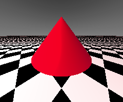

<link rel="stylesheet" href="../assets/help.css"/>

[bob]: <../tools/bob.html>
[studio]: <studio.html>

# Antialiasing

The `antialias` keyword sets the antialiasing mode.

This keyword is only valid in the context of the `studio` structure.

# Usage

```
  studio {
    antialias       none          // No antialiasing
    antialias       corners       // Average four pixel corners
    antialias       quick         // Quick sliding window
    antialias       adaptive      // Adaptive sliding window
  }
```

# Modes

There are four modes:

* quick
* none
* corners
* adaptive

In general, the more realistic the desired scene, the slower
the required AA mode is. These modes are listed above in order
of _decreasing_ speed and _increasing_ realism.

# Quick Mode

This is the fastest mode and creates only a rough approximation of the scene.


The image above shows a scene rendered with **quick** mode.

# None Mode

This is the default mode and creates only a fair approximation of the scene.
It shoots one original ray per pixel.



The image above shows a scene rendered with **none** mode.

# Corners Mode

This is an intermediate mode and creates only a good approximation of the scene.
It shoots original rays through the four corners of each pixel and averages
the results.


The image above shows a scene rendered with **corners** mode.

# Adaptive Mode

This is the most realistic and slowest mode. It's best in general to save
this for finished scenes only. This mode uses an adaptive sampling
technique that shoots more rays when finer details are encountered,


The image above shows a scene rendered with **adaptive** mode.

# Studio Structure

* See: [studio][studio]

# Command Line

The AA mode can be overriden on the command line with the `-a` option.

* See: [Bob][bob]

---