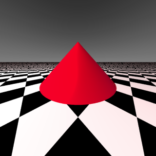

<link rel="stylesheet" href="../assets/help.css"/>

[studio]: <studio.html>
[proj-mode]: <proj-mode.html>
[aa_modes]: <aa-mode.html>

# Camera

Since this is such an extensive topic, I've decided to give it a separate chapter.

The camera settings are contained in the `studio` structure. This may change in
future versions.

* See: [studio][studio]

# Usage

```
  studio {

    at              x y z         // Point to observe
    from            x y z         // Eye location
    up              x y z         // Up direction

    angle           degrees       // Field of view
    width           f             // Lens aperture width
    aspect          f             // View aspect ratio

    aperture        f             // Lens aperture
    focal_length    f             // Lens focal length
    samples         i             // Sample count (non-pinhole lens)
    jitter                        // Enable camera jitter

    projection      fisheye       // Fisheye projection
    projection      flat          // Flat projection
    projection      no_parallax   // Same as flat
    projection      orthogonal    // Perspective projection

  }
```

## Viewpoint

The view matrix is determined by the `at`, `from` and `up` keywords.

### At

> This is a point used to determine the normal vector for the lens.

The default is (0, 0, 0).

### From

> This is a point that tells where the camera is located.

The default is (0, 0, 0).

### Up

> This is a vector determining which direction is up.

The default is (0, 0, 1).

## FOV Angle

> This is the lens' field of view angle. 

The default is 0, which yields an angle of 90.

Note that this angle represents to both halves of
the viewing frustrum combined. It's common practice in
graphics programming to specify view frustrum angles as 1/2 of the
total angle. But Bob does not do this. However, the `width` keyword
(shown below) does do this.

## FOV Aspect

> This is the lens' field of view aspect.

The default is 1.

Internally, Bob uses two FOV angles (one for x and one for y).

The aspect is used to calculate the y FOV from the x FOV.

## Len Aperture

> This is the lens' focal length aperture.

The default is 0.

This works in conjunction with focal length to yield blurring effects
for objects closer to or further away from the focal length.

With an aperture greater than zero, blurring occurs. The larger the aperture,
the more exaggerated the blurring.

## Lens Focal Length

> This is the lens' focal length.

The default is 0.

Focal length determines where in the scene sharp focus should occur.
This is always used in conjunction with aperture.

## Lens Width

> This is the width of the camera lens.

**NOTE**: This is not discussed in the book, so more details are needed.

Width is an alternate means of specifying lens `angle` (shown above). Whereas angle
is in degrees, width is in radians and should have half the value that `angle` would.

For example, an angle of 60 should have a width of PI/6.

That is, 60/2 = 30 and 30 degrees = PI/6 radians.

## Samples

> This is the number of rays shot for non-pinhole cameras.

The default is 0.

A non-pinhole camera has the following properties:

* angle
* aspect
* focal_length
* aperture
* samples

## Jitter

> When present this turns on camera jitter.

The default is for jitter to be off.

Camera jitter adds some softness to the scene, but is
helpful in reducing aliasing.

This is not an anti-aliasing mode. It works in
all modes.

* See: [Antialiasing][aa_modes]

### Example With Jitter



The image above shows an image with jitter. 

### Example Without Jitter


The image above shows the same image without jitter. 

Notice the band right near the horizon. This is where
aliasing is worst.

## Projection

> This sets the projection mode.

The default is flat.

* See: [Projection Mode][proj-mode]

# Synonyms

The following synonyms apply:

| Keyword | Synonym |
| --- | --- |
| resolution | res |
| orthogonal | ortho |
| center | from |
| position | from |
| offset | from |
| translate | from |

---
