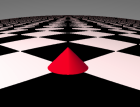
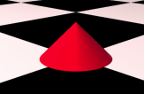
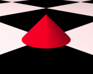
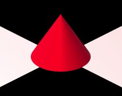

<link rel="stylesheet" href="../assets/help.css"/>

[studio]: <studio.html>

# Projection Mode

The `projection` keyword sets the antialiasing mode.

This keyword is only valid in the context of the `studio` structure.

# Usage

```
studio {
    projection      fisheye       // Fisheye projection
    projection      flat          // Flat projection
    projection      no_parallax   // Same as flat
    projection      orthogonal    // Perspective projection    
}
```

# Modes

There are four projection modes:

* fisheye
* flat
* no_parallax
* orthogonal

# Fisheye Projection

This creates a fisheye lens affect.



The image above shows a **fisheye** projection of a cone on a checker floor.

# Flat Projection

This is the default mode. Nothing special.



The image above shows a **flat** projection of a cone on a checker floor.

# No Parallax Projection

This is identical (I believe) to flat projection.



The image above shows a **no_parallax**** projection of a cone on a checker floor.

# Orthogonal Projection

This creates an orthogonal view, which inhibits
perspective foreshortening.



The image above shows an **orthogonal** projection of a cone on a checker floor.

# Synonyms

The following synonyms apply:

| Keyword | Synonym |
| --- | --- |
| orthogonal | ortho |

# Studio Structure

* See: [studio][studio]

---
