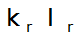
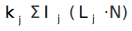

<link rel="stylesheet" href="../../assets/help.css"/>

[snell]: <https://en.wikipedia.org/wiki/Snell's_law>
[light]: <light.html>

# Lambert's Color Model

Bob used Lambert's Diffuse Reflectance color model.

Surfaces are strongly affected by light. For lighting and other
related links:

* [See Also](../see-also.html)

# Variables

| Variable | Meaning | Notes |
|-|-|-|
| Kd | Diffuse coefficent | 3 |
| Ks | Specular coefficient | 3 |
| Kt | Transmissive coefficient | 3 |
| Ka | Ambient coefficient | 3 |
| Kh | Specular hilight | 3 |
| Ns | Specular exponent | 3 |
| N | Surface normal at POI | 1, 2 |
| V | Incident ray vector | 2 |
| R | Reflected ray vector | 2 |
| E | Eye to POI vector | 2 |
| Ln | Vector to Nth light source | 2 |
| Hn | Reflected Ln vector | 2 |
| I | Final color | 4 |
| Ia | Ambient illumination | 3 |
| Ir | Reflected ray illumination | 3 |
| It | Transmitted ray illumination | 3 |
| In | Nth light source illumination | 3 |

### Notes
1. POI is Point Of Intersection
2. Vector
3. Real number
4. Color

# Equation

```
I = ambient + diffuse + specular + transmitted + hilite
```

# Diffuse Color

Diffuse coefficient is the dot product of the surface normal @ POI and
the vector to the Nth light source. Values for each light source are
summed.

```
Kd = VecDot(N, Ln)
```

If Ks <= 0, it is treated as 0.


The above image shows the equation for ambient light.

# Specular Color

Specular color has two aspects:

* Reflectance
* Shine

Reflectance gives the mirrorlike surface which reflects part
of the scene.

Shine gives the shiny dot (or high light) that represents where
the light intensity is greatest.

```
// Shine coefficient
Kh = pow(-VecDot(H, E), Ns)
```


The above image shows the equation for specular shine high light.



The above image shows the equation for reflective specular light.

# Diffuse Color



The above image shows the equation for diffuse light.

# Transmissive Color


The above image shows the equation for transmissive light.

# Ray Reflection


The above image shows the equation for ray reflection.

| Variable | Description |
|-|-|
| N | Surface normal |
| I | Incident ray |
| R | Reflected ray (result) |

# Snell's Equation

For transmissive calculations, rays must be refracted. This requires
the use of __Snell's Law__ for refraction.


The images above show various derivations of Snell's law.

See the bibiolgraphy for a link to the related wiki article.

# Bibliography

```
Photorealism and Ray Tracing in C
Watkins, Coy and Finlay
ISBN 1-55851-247-0
Chapter 9

```

[Snell's Law Wiki][snell]

---


