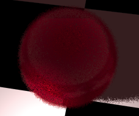

<link rel="stylesheet" href="../assets/help.css"/>

[texmap]: <texmap.html>
[texproc]: <texproc.html>
[bump]: <bump.html>
[solid]: <solid.html>
[lambert]: <./lambert/lambert.html>
[iorlist]: <https://en.wikipedia.org/wiki/List_of_refractive_indices>

# Surf Structure

Use surfaces to control the surface properties of primitives.

Bob maintains an internal list of surfaces. Only the most recent is
assigned to a primitive, so the order in which you define surfaces
(where in your scene code) is important.

Surfaces are strongly affected by light. For lighting and other
related links:

* [See Also](see-also.html)

# Usage

```
  surface {
    ambient         r g b         // Ambient color
    diffuse         r g b         // Diffuse color
    specular        r g b         // Specular color
    transparent     r g b         // Transparent color
    fuzz            f             // Fuzziness
    ior             f             // Index of refraction
    shine           f             // Shine coefficient
    shine           f r g b       // Shine coefficient and color
    ambient         {}            // Ambient texture map
    diffuse         {}            // Diffuse texture map
    specular        {}            // Specular texture map
    transparent     {}            // Transparent texture map
    bump            {}            // Bump map
    texture         {}            // Procedural texture
    no_antialias                  // Disable antialiasing
  }
```

<a name="color"></a>

# Color

Bob uses the [Lambertian][lambert] color model.

```
surface {
    ambient     r g b         // Ambient color
    diff        r g b         // Diffuse color
    spec        r g b         // Specular color
    xpar        r g b         // Transparent color
}
```

* See: [Solid Colors][solid]

<a name="fuzz"></a>

# Fuzz

This adds fuzziness to the surface.

```
surface {
    fuzz f
}
```

The default value is 0.

The `f` argument should be a real number >= 0.

The larger the number, the more the fuzziness.



The image above shows a fuzzy sphere.

<a name="ior"></a>

# IOR

This is the _Index of Refraction_ for transmissive surfaces.

```
surface {
    ior f
}
```

The `f` argument should be a real number >= 0.

The larger the number, the more the refraction bends.

The default is 1.0 (no bending).

For glass, use 1.1 to 1.3. For diamond, use 2.6 instead.


The image above shows two transmissive spheres.

The one on the left has an ior of 1 (default).

The one on the right has an ior of 5.

* See: [IOR List Wiki][iorlist]

<a name="shine"></a>

# Shine

This is the _specular shine_ effect. Not to be confused with
specular color or texturing.

There are two available formats for shine. The first specifies
only an exponent for falloff (color is assumed white).

```
surface {
    shine k
}
```

The alternative allows you to specify a color as well.

```
surface {
    shine k r g b
}
```

The default `k`is 0.

The default color is the `specular` color.

Note that `k` is any real number >= 0.


The image above shows the effects of shine. Note the oblong
bright spot on the primitive.

<a name="texturemap"></a>

# Texture Maps

```
surface {
    ambient     k k k         // Ambient intensity
    diff        k k k         // Diffuse intensity
    spec        k k k         // Specular intensity
    xpar        k k k         // Transparent intensity
    ambient     {}            // Ambient texture map
    diff        {}            // Diffuse texture map
    spec        {}            // Specular texture map
    xpar        {}            // Transparent texture map
}
```

* See: [Texture Maps][texmap]

<a name="bump"></a>

# Bump Maps

```
surface {
    bump {}     // Bump map structure
}
```

The default is no bump map.

* See: [Bump Maps][bump]

<a name="texure"></a>

# Procedural Textures

```
surface {
    texture {}     // Texture structure
}
```

The default is no texture.

* See: [Procedural Textures][texproc]

# No Antialias

When present, this flag turns __off__ antialiasing for all primitives
that use the surface.

```
surf {
    no_antialias
}
```

<a name="synonyms"></a>

# Synonyms

The following synonyms are applicable.

| Keyword | Synonym |
| - | - |
| diffuse | diff |
| specular | spec |
| surface | surf |
| transparent | xpar |

---

