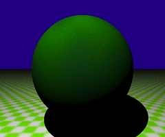
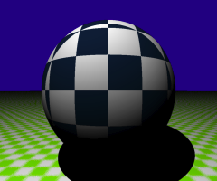
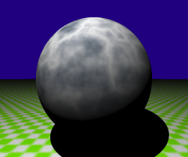
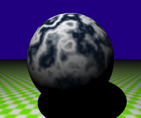

<link rel="stylesheet" href="../assets/help.css"/>

# Texture Structure

The `texture` structure can only be used in the context of a `surface` structure.

It allows you to create procedural textures.

# Usage

```
  texture {
    pattern         checker       // Checkerboard pattern
    pattern         noise         // Noise pattern
    pattern         spherical     // Spherical pattern
    translate       x y z         // Translate texture space
    scale           x y z         // Scale texture space (discrete)
    blend           f             // Blend coefficient
    fuzz            f             // Fuzziness coefficient
    radius          f             // Radius (1 or 2)
    scale           f             // Scale texture space (uniform)
    terms           i             // Number of terms
    turbulence      {}            // Turbulence block
    wave            {}            // Noise block
    surface         {}            // Surface block (0, 1 or 2)
  }
```

# Surfaces

Procedural textures are only used within `surface` context.

[surf]: <../surf/surf.html>

* See: [surf][surf]

Textures may also contain 0, 1 or 2 embedded surfaces.

For 0, the texture uses the parent surface and solid black.

For 1, the texture uses that and the parent surface.

For 2, the texture uses those two surfaces.

Understand that textures modulate colors between these two surfaces. You
can also modulate normals (shades) using the `bump` structure.

[bump]: <../bump/bump.html>

* See: [bump][bump]

# Turbulence and Waves

> Covered in separate topics:

[turb]: <../turb/turb.html>
[wave]: <../wave/wave.html>

* See: [turb][turb]
* See: [wave][wave]

# Transform

> Creates a transform matrix for texture coordinates.

```
  texture {
    translate       x y z         // Translate texture space
    scale           x y z         // Scale texture space (discrete)
    scale           f             // Scale texture space (uniform)
  }
```

The default for `translate` is `(0, 0, 0)`.

The default for `scale` is `(1, 1, 1)`.

# Blending

> Set the blending coefficient.

```
  texture {
    blend           f             // Blend coefficient
  }
```

Here `f` is any real number.

The default is `0`.

The typical range is `[0 ⋯ 8]`.

# Fuzziness

> Set the fuzziness coefficient.

```
  texture {
    fuzz            f             // Fuzziness coefficient
  }
```

Here `f` is any real number.

The default is `0`.

The typical range is `[0 ⋯ 1]`.

<figure>

</figure>

The above image demonstrates fuzz with noise.

# Radius

> Set the radius or radii.

```
  texture {
    radius          f             // Radius (1 or 2)
  }
```

Here `f` is some real number ≠ 0.

The default is `1`.

The typical range is `[0 ⋯ 10]`.

This affects the transformation matrix for scaling. If one radius is
specified, it is the outer radius. The inner is zero.

If two radii are specified, one is the outer and the other
is the inner.

# Terms

> Set the number of terms.

```
  texture {
    terms           i             // Number of terms
  }
```

Here `i` is some integer >= 0.

The default is `0`.

# Checker Patterns

> Produce a checkerboard pattern.

```
  texture {
    pattern         checker       // Checkerboard pattern
  }
```

<figure>

</figure>

The above image demonstrates a checker pattern.

Note that the checkerboard pattern should **not** be used with _waves_ or _turbulence_
unless you want some really wonky results.

# Noise Patterns

> Produce a noise pattern.

```
  texture {
    pattern         noise         // Noise pattern
  }
```

<figure>

</figure>

The above image demonstrates a noise pattern.

# Spherical Patterns

> Produce a spherical pattern.

```
  texture {
    pattern         spherical     // Spherical pattern
  }
```

<figure>

</figure>

The above image demonstrates a spherical pattern.

# Synonyms

The following synonyms are applicable.

| Keyword | Synonym |
| - | - |
| turb | surface |
| surf | turbulence |
| center | translate |
| position | translate |
| offset | translate |
| from  | translate |

---
