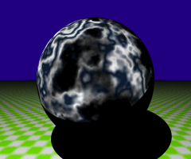

<link rel="stylesheet" href="../assets/help.css"/>

# Turb Structure

The `turb` structure can only be used in the context of the `bump` or `texture` structure. Furthermore, the
`bump` and `texture` can only be used in `surface`.

[bump]: <../bump/bump.html>
[texture]: <../texture/texture.html>
[surf]: <../surf/surf.html>

* See: [bump][bump]
* See: [texture][texture]
* See: [surf][surf]

It creates surface turbulence.

# Usage

```
  turb {
    scale           x y z         // Scale turbulence space (discrete)
    translate       x y z         // Translate tubluence space
    scale           f             // Scale turbulence space (uniform)
    amplitude       f             // Amplification coefficient
    terms           i             // Number of terms
  }
```

# Scale

> Modifies scaling factors.

```
  turb {
    scale           x y z         // Scale turbulence space (discrete)
    scale           f             // Scale turbulence space (uniform)
  }
```

The default is (1, 1, 1).

# Translate

> Translates the pattern.

```
  turb {
    translate       x y z         // Translate tubluence space
  }
```

The default is (0, 0, 0).

# Amplitude

> Changes the turbulence amplitude.

```
  turb {
    amplitude       f             // Amplification coefficient
  }
```

The default is 1.

This is some real number > 0.

# Terms

> Changes the number of terms.

```
  turb {
    terms           i             // Number of terms
  }
```

The default is 1.

Here `i` is some integer >= 0.

The default is `0`.

# Examples

> Bump Turbulence Example

```
surface {
    diff red
    ambient .2 0 0
	bump {
		turb {
			scale 1 1 1
			offset 0 0 0
			amplitude 2
			terms 6
		}
	}
}
```

<figure>

</figure>

The above source code and image show turbulence being used in a `bump` structure.

> Texture Turbulence Example

```
surf { 
	texture { 
		pattern spherical 
		turb { 
			terms <terms> 
			amp 5
		}
		blend .8
		radius 1
		surf { diff 0 .1 .2 }
		surf { diff white }
	}
}
```

The source code above shows how the below example was generated. The `<terms>` token represents a variable which is changed by the source code during compilation of the scene file.

<figure>

</figure>

The above source code and image show turbulence being used in a `texture` structure. It also demonstrates terms [0 .. 8] in reading order.

> Bump and Texture Turbulence Example

```
surf {
    diff yellow
    texture { 
        pattern spherical 
        turb { 
            terms 4 
            amp 5
        }
        blend .8
        radius 1
        surf { diff 0 .1 .2 }
        surf { diff white }
    }
	bump {
		turb {
			scale 1 1 1
			offset 0 0 0
			ampl 2
			terms 6
		}
	}
}
```

<figure>

</figure>

The above image and source code show turbulence being used in both a `bump` and a `texture` context.

# Synonyms

The following synonyms are applicable.

| Keyword | Synonym |
| - | - |
| surf | surface |
| turbulence | turb |
| center | translate |
| position | translate |
| offset | translate |
| from  | translate |

---
