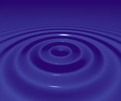
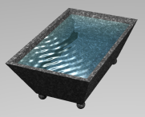

<link rel="stylesheet" href="../assets/help.css"/>

# Wave Structure

The `wave` structure can only be used in the context of the `bump` or `texture` structure. Furthermore, the
`bump` and `texture` can only be used in `surface`.

[bump]: <../bump/bump.html>
[texture]: <../texture/texture.html>
[surf]: <../surf/surf.html>

* See: [bump][bump]
* See: [texture][texture]
* See: [surf][surf]

It creates surface waves.

# Usage

```
  wave {
    center          x y z         // Location in surface space
    amplitude       f             // Amplification coefficient
    damping         f             // Damping coefficent (per wave)
    phase           f             // Phase shift in cycles
    wavelength      f             // Wave length
  }
```

# Location

> Location of the wave.

```
  wave {
    center          x y z         // Location in surface space
  }
```

Te default is `(0, 0, 0)`.

# Amplitude

> Amplitude of the wave.

```
  wave {
    amplitude       f             // Amplification coefficient
  }
```

The default is `0.1`.

# Damping

> Damping factor for the wave.

```
  wave {
    damping         f             // Damping coefficent (per wave)
  }
```

The default is `1.0`.

This is some real number >= 0.

# Phase

> This is the phase of the wave.

```
  wave {
    phase           f             // Phase shift in cycles
  }
```

The default is `0.0`.

This is some real number.

# Wavelength

```
  wave {
    wavelength      f             // Wave length
  }
```

The default is `0.0`.

This is some real number >= 0.

# Example

> Simple Waves

```
surf {
 	diff .1 .2 .2
	transparent .7 .8 .9
	ior 1.2
	shine 100 white
    bump {
       wave {
            center 0 0 0
            amp 10
            phase .2
            damping .5
            wavelength 2
        }
    }
}
```

<figure>

</figure>

The above source code and image demonstrate simple waves.

> Complex Waves

```
surf {
	diff .1 .2 .2
	transparent .7 .8 .9
	ior 1.2
	shine 100 white
	bump {
		// primary wave
		wave { center -2.2 .2 1 wavelength .2 amp .2 damping .9 }
		// reflected waves
		wave { center -2.85 .2 1   wavelength .2 amp .2 damping .9 }
		wave { center -1.15 .2 1   wavelength .2 amp .2 damping .9 }
		wave { center -2.2 .85 1   wavelength .2 amp .2 damping .9 }
		wave { center -2.2 -1.35 1 wavelength .2 amp .2 damping .9 }
	}
}
```

<figure>

</figure>

The above source code and image demonstrate complex waves.

# Synonyms

The following synonyms are applicable.

| Keyword | Synonym |
| - | - |
| center | translate |
| position | translate |
| offset | translate |
| from  | translate |

---
